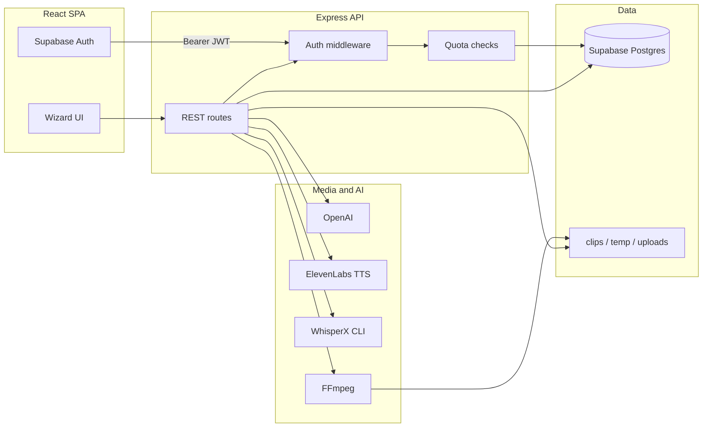

# ClipForge

Personal project: a web app that writes Reddit-style stories with GPT, reads them with ElevenLabs, and stitches everything into a vertical short (9:16) with subtitles, background gameplay, and mood music. There is a step-by-step wizard on the frontend plus login, usage limits, and Stripe if you want paid tiers.

I built this to practice hooking a bunch of real APIs and FFmpeg together in one project.

**Output:** 
[](https://www.youtube.com/shorts/6MkIO42Usqk)
[Watch here](https://www.youtube.com/shorts/6MkIO42Usqk)

---

## What it actually does

- Pick a subreddit vibe (AITA, TIFU, etc.), optional background, ElevenLabs voice (you can preview voices), edit the story, then hit generate.
- Backend: TTS audio from Elevenlabs, WhisperX for word timings, group words into caption chunks, merge with a trimmed clip from `backend/background/video.mp4`, speed tweak, mix in a random MP3 from `backend/music/<genre>/`.
- Users sign in with Supabase. The server checks JWTs and caps how many videos you can make per month depending on tier.
- Stripe checkout + webhooks update subscription rows in Supabase (`subscriptions`, `monthly_usage`). SQL to create tables is in `backend/supabase-schema.sql`.

---

## Rough architecture



---

## Stack (quick)

|------|--------|
| Frontend | React 19, Vite, React Router, Axios, some MUI / Emotion |
| Backend | Node, Express 5, Multer, fluent-ffmpeg |
| Auth / DB | Supabase (Auth + Postgres + RLS), service role only on the server |
| Payments | Stripe |
| AI / audio / video | OpenAI, ElevenLabs, WhisperX, FFmpeg |

There are also older routes for uploading long videos and auto-cutting highlights if you dig through `backend/index.js`.

---

## Folder layout

```
AutoClip/
├── src/                 # React app
├── backend/
│   ├── index.js         # most API + video code
│   ├── auth.js
│   ├── subscriptions.js
│   ├── stripe.js
│   ├── supabase.js
│   ├── supabase-schema.sql
│   ├── background/      # put parkour1.mp4 (or change the path in code)
│   ├── music/<genre>/
│   ├── clips/           # output videos
│   └── temp/            # scratch files
└── README.md
```

---

## Run it locally

**You need:** Node, FFmpeg on your PATH, Python 3 with WhisperX so `whisperx` works in a terminal (`pip install whisperx`), a Supabase project (run the SQL file once), OpenAI and ElevenLabs keys.

```bash
npm install
cd backend && npm install
```

**Frontend `.env` (repo root):** `VITE_SUPABASE_URL`, `VITE_SUPABASE_ANON_KEY`

**Backend `backend/.env`:** `SUPABASE_URL`, `SUPABASE_SERVICE_ROLE_KEY`, `OPENAI_API_KEY`, `ELEVENLABS_API_KEY`, optional Stripe vars (`STRIPE_SECRET_KEY`, `STRIPE_WEBHOOK_SECRET`, price IDs, `FRONTEND_URL`). 

```bash
# terminal 1
cd backend && node index.js

# terminal 2
npm run dev
```

Default background path the code expects: `backend/background/parkour1.mp4`.

---

## API stuff

| Method | Path | Note |
|--------|------|------|
| POST | `/auth/*` | auth stuff |
| POST | `/subscription/*` | needs Bearer token |
| POST | `/stripe/*` | checkout; webhook wants raw body |
| POST | `/generate-story-text` | GPT story from genre |
| GET | `/voices` | voice list |
| GET | `/preview-voice/:voiceId` | short preview clip, cached on disk |
| POST | `/finalize-story` | needs token + quota, runs the full video job |

Send `Authorization: Bearer <Supabase access token>` on protected routes.

---

## WhisperX on Windows / CPU

If WhisperX blows up on float16 on CPU, you can add `--compute_type float32` in `runWhisperX`. If Pyannote model loading freaks out on newer PyTorch, try `--vad_method silero` in the same spawn args. Edit `backend/index.js` where `whisperx` is spawned.

---

## Heads up

This makes AI voice+video content. Check YouTube/TikTok rules, label stuff honestly if a platform asks, and respect OpenAI/ElevenLabs terms plus copyright on B-roll and music. I am not a lawyer, just don’t be sketchy.

---

## License

MIT

---

## Contact

William Ghanayem
**Email:** Wkg2rs@gmail.com
