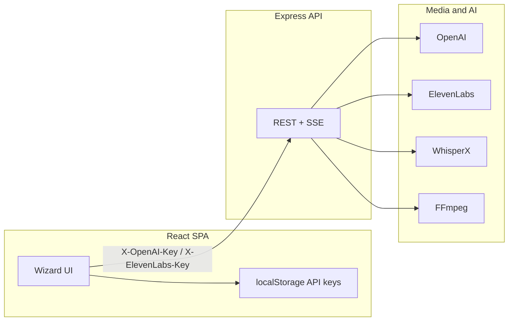

# ClipForge

Turn Reddit-style stories into vertical short-form videos (9:16) — GPT writes the story, ElevenLabs narrates it, FFmpeg + WhisperX handle captions, background gameplay, and mood music.

**Live demo mode:** no accounts, no server-side API keys. Users bring their own OpenAI and ElevenLabs keys in the wizard (stored in browser localStorage only).

**Demo:**
[](https://www.youtube.com/shorts/6MkIO42Usqk)
[Watch here](https://www.youtube.com/shorts/6MkIO42Usqk)

---

## What it does

1. **API keys** — user enters OpenAI + ElevenLabs keys (localStorage)
2. **Subreddit vibe** — AITA, TIFU, Malicious Compliance, etc.
3. **Background** — Minecraft parkour clip (trimmed from a longer source video)
4. **Voice** — ElevenLabs preview + selection
5. **Story** — GPT generates text; user can edit before render
6. **Generate** — full pipeline with live progress logs in the UI

**Pipeline:** ElevenLabs TTS → trim/scale background (FFmpeg) → WhisperX word timings → burn subtitles → 1.4× speed → mix genre-matched background music → download MP4.

---

## Architecture


```mermaid
flowchart LR
  subgraph client [React SPA]
    UI[Wizard UI]
    Keys[localStorage API keys]
  end
  subgraph api [Express API]
    R[REST + SSE]
  end
  subgraph workers [Media and AI]
    OAI[OpenAI]
    EL[ElevenLabs]
    WX[WhisperX]
    FF[FFmpeg]
  end
  UI --> Keys
  UI -->|X-OpenAI-Key / X-ElevenLabs-Key| R
  R --> OAI
  R --> EL
  R --> WX
  R --> FF
```

---

## Stack

| Part | Tech |
|------|------|
| Frontend | React 19, Vite, React Router, Axios |
| Backend | Node, Express 5, fluent-ffmpeg, Multer |
| AI / media | OpenAI, ElevenLabs, WhisperX, FFmpeg |

Legacy routes for uploading long videos and auto-cutting highlights still exist in `backend/index.js` from an earlier version of the project.

---

## Run locally

**Requirements:** Node (LTS), FFmpeg on PATH, Python 3 + WhisperX (`pip install whisperx`). No `.env` secrets needed — users enter API keys in the app.

```bash
npm install
cd backend && npm install
```

```bash
# terminal 1 — keep running
cd backend && node index.js

# terminal 2 — keep running
npm run dev
```

Open http://localhost:5173

**Assets you need locally (not in git):**
- `backend/background/parkour1.mp4` — background gameplay source
- `backend/music/<genre>/` — MP3 files per subreddit folder (AITA, TIFU, etc.)

**Optional env (`FFMPEG_GPU`):** `auto` (default, uses NVENC if available), `off`, `nvenc`, `qsv`, `amf`. Cloud hosts have no GPU — use `off`.

---

## API

| Method | Path | Headers |
|--------|------|---------|
| POST | `/generate-story-text` | `X-OpenAI-Key` |
| GET | `/voices` | — |
| GET | `/preview-voice/:voiceId` | `X-ElevenLabs-Key` |
| POST | `/finalize-story` | both keys; streams SSE progress events |

---

## Deployment note

This is built as a **local / self-hosted demo**. The pipeline needs FFmpeg, WhisperX, disk for temp files, and long-running requests (minutes per video). CPU-only hosts (e.g. Render free tier) work but are slow; GPU encoding only helps on machines that have it.

---

## Legal / ethics

AI-generated voice + video content — follow platform rules (YouTube, TikTok, etc.), respect OpenAI/ElevenLabs ToS, and don't use copyrighted B-roll or music you don't have rights to.

---

## License

MIT

---

## Contact

**William Ghanayem** — Wkg2rs@gmail.com
